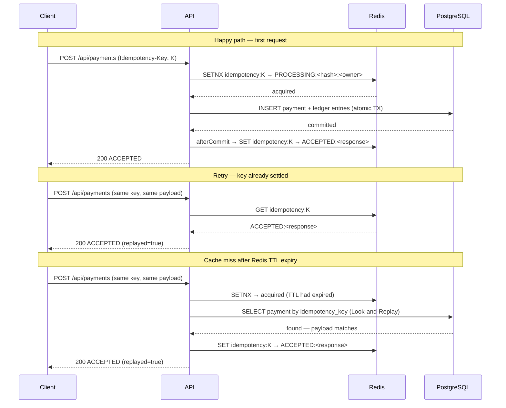

# Idempotent Payment Ledger

[](https://github.com/tuanhiep/idempotent-payment-ledger/actions/workflows/ci.yml)

A production-shaped case study in retry-safe payment intake and balanced ledger mutation. It accepts a payment request with an `Idempotency-Key`, persists the first outcome atomically, replays duplicate requests with the same payload, rejects reused keys with different payloads, and records balanced debit/credit ledger entries. Within the declared failure envelope, retries do not create duplicate payments and the current posting rule commits both ledger sides atomically.

The bar for this module is evidence, not labels: every claim is implemented in code, covered by tests, or explicitly listed as a production gap.

## Why This Is Hard

Most payment idempotency tutorials stop at "store the key, return the cached response." Production systems break in the gaps they skip:

- A server processes a request but crashes before the client receives the response. The client retries. Should the second attempt charge again?
- Two retries arrive simultaneously before either has received a response. Which one wins, and what does the loser return?
- Redis marks a payment `ACCEPTED` — but the database transaction rolls back a millisecond later. The cache now lies.
- Redis TTL expires mid-flight. A replacement request acquires the lease. The original request's cleanup call must not evict the new owner.

Solving these requires more than a cache: it requires reasoning about commit boundaries, ownership tokens, and recovery paths.

## Problem

Payment APIs live in an unreliable world:

- clients retry after timeouts;
- servers may process a request but fail before the client receives the response;
- duplicate requests can double-charge a payer;
- reused idempotency keys with changed payloads can hide caller bugs or abuse;
- ledger entries must remain balanced even under retries.

The system must make payment intake retry-safe while preserving auditability and correctness.

## Architecture



## Evidence Map

| Artifact | What it proves |
|---|---|
| [Engineering Narrative](docs/ENGINEERING_NARRATIVE.md) | The problem, failure kernels, design choices, and interview-ready technical story |
| [Design Document](docs/DESIGN_DOC.md) | Requirements, consistency model, transaction boundaries, alternatives, and open questions |
| [Failure Modes](docs/FAILURE_MODES.md) | Expected behavior, executable evidence, and residual failure risk |
| [ADR-001: Persistence Schema](docs/ADR-001-persistence-schema.md) | PostgreSQL authority, idempotency constraints, and durable processing trade-offs |
| [ADR-002: Redis Reservation Ownership](docs/ADR-002-redis-reservation-ownership.md) | Owner tokens, lease expiry, and atomic compare-and-set/delete |
| [Operations Runbook](docs/OPERATIONS_RUNBOOK.md) | Failure diagnosis, owner-safe intervention, reconciliation, and migration rollout |
| [Gate Checklist](GATE_CHECKLIST.md) | Passed evidence gates and intentionally deferred capabilities |

## Design Invariants

- `Idempotency-Key` identifies one logical payment attempt.
- The first accepted payload for a key owns that key.
- A duplicate request with the same key and same payload returns the stored response.
- A duplicate request with the same key and a different payload returns `409 Conflict`.
- A successful payment creates exactly two ledger entries: one debit and one credit.
- Ledger entries for one transaction must sum to zero.
- Invalid requests must not mutate ledger state.
- The durable adapter uses PostgreSQL uniqueness and Flyway-managed schema as the production-like correctness boundary.

## Running the Application

### 1. Start Infrastructure
Spin up the PostgreSQL and Redis containers:
```bash
docker compose up -d
```

### 2. Run Application
Choose one of the two active profiles to run the application:

*   **Default Mode (PostgreSQL)**:
    Uses PostgreSQL for both durable idempotency records and ledger state. This is the smallest runnable correctness configuration and does not require Redis.
    ```bash
    ./mvnw spring-boot:run
    ```

*   **Production-Like Hybrid Mode (PostgreSQL + Redis)**:
    Uses PostgreSQL as the authoritative correctness boundary and Redis as an outer reservation/cache layer. Redis reservations carry owner tokens and use atomic compare-and-set/delete scripts so an expired owner cannot overwrite or delete a replacement lease. This mode demonstrates production-style failure handling; throughput and capacity claims remain deferred until measured.
    ```bash
    ./mvnw spring-boot:run -Dspring-boot.run.profiles=jpa,redis
    ```

### 3. Seed Local Demo Accounts

After the application starts and Flyway creates the schema, load the two accounts used by
the request example:

```bash
docker compose exec -T postgres \
  psql -U paymentledger -d paymentledger \
  < scripts/seed-local-accounts.sql
```

Demo data is deliberately kept outside Flyway migrations so schema rollout never inserts
test accounts.

## Implemented Endpoints

Create a payment:

```bash
curl -i -X POST "http://localhost:8080/api/payments" \
  -H "Content-Type: application/json" \
  -H "Idempotency-Key: demo-payment-001" \
  -d '{
    "payerAccountId": "acct-payer",
    "merchantAccountId": "acct-merchant",
    "amount": 100.00,
    "currency": "USD"
  }'
```

Replay the same request with the same key to receive the original outcome with `replayed=true`.

Change the amount while reusing the key to receive `409 Conflict`.

## Test Matrix

Covered by `PaymentIntakeServiceTest`:

- first payment creates two balanced ledger entries;
- duplicate request with the same key and payload returns the stored response;
- concurrent duplicate requests with the same key create one ledger transaction in the demo process;
- duplicate key with a different payload is rejected;
- invalid amount is rejected before ledger mutation.

Covered by `PaymentControllerIntegrationTest`:

- HTTP duplicate request is replayed;
- HTTP duplicate key with changed payload returns `409 Conflict`.

Covered by persistence and upgrade-path tests:

- PostgreSQL uniqueness resolves concurrent writers to one payment plus one replay;
- account locking prevents concurrent overdraft;
- Redis stale owners cannot delete or complete over replacement reservations;
- Flyway V4 preserves historical accounts referenced by ledger entries while removing unused fixtures.

`PaymentLedgerApplicationTests` verifies Spring context wiring.

Persistence tests use PostgreSQL through Testcontainers and the same Flyway
migration used by local Docker. Docker must be running for the persistence
suite; these tests fail fast rather than falling back to H2.

Run the complete evidence suite from the repository root:

```bash
./mvnw clean test
```

Current closure evidence: 33 tests execute against PostgreSQL 16 and Redis 7 through Testcontainers. GitHub Actions runs the same clean evidence suite on every push to `main`.

## Production Gaps

- The in-memory adapter remains only for fast unit-level semantics tests; the default runnable profile uses JPA/PostgreSQL.
- A process crash after a durable JPA `PROCESSING` reservation is committed can leave that key blocked. `expires_at` is stored, but automatic reclaim/cleanup and fencing semantics are deliberately deferred.
- The current posting rule generates one matched debit/credit pair and commits both atomically. PostgreSQL does not yet enforce a generalized cross-row sum-to-zero constraint for future posting rules.
- No transactional outbox exists yet.
- No auth or tenant model exist yet.
- Observability features domain metrics for accepted, replayed, conflict, in-progress,
  invalid, and failed requests, but does not yet emit structured tracing spans.
- Account-to-ledger reconciliation requires an explicit opening-balance transaction or snapshot baseline; the current module proves transaction-level balance and defers the reconciliation worker.

## Deferred Extensions

The following capabilities are intentionally outside this module's closure boundary:

- Implement a Transactional Outbox pattern to safely publish ledger events to a message broker (e.g. Kafka).
- Refactor Spring Profiles to a centralized `@Configuration` class using `@ConditionalOnMissingBean` for cleaner bean overriding.
- Design load test scripts and run capacity estimates under high throughput.
